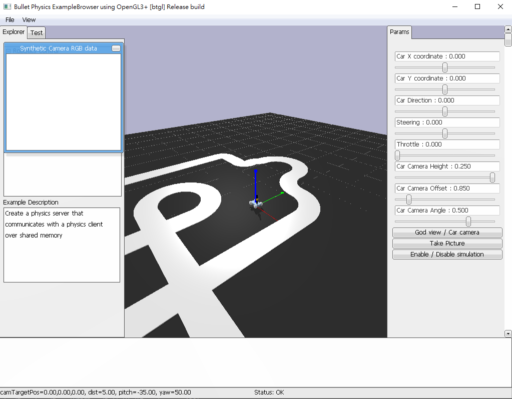
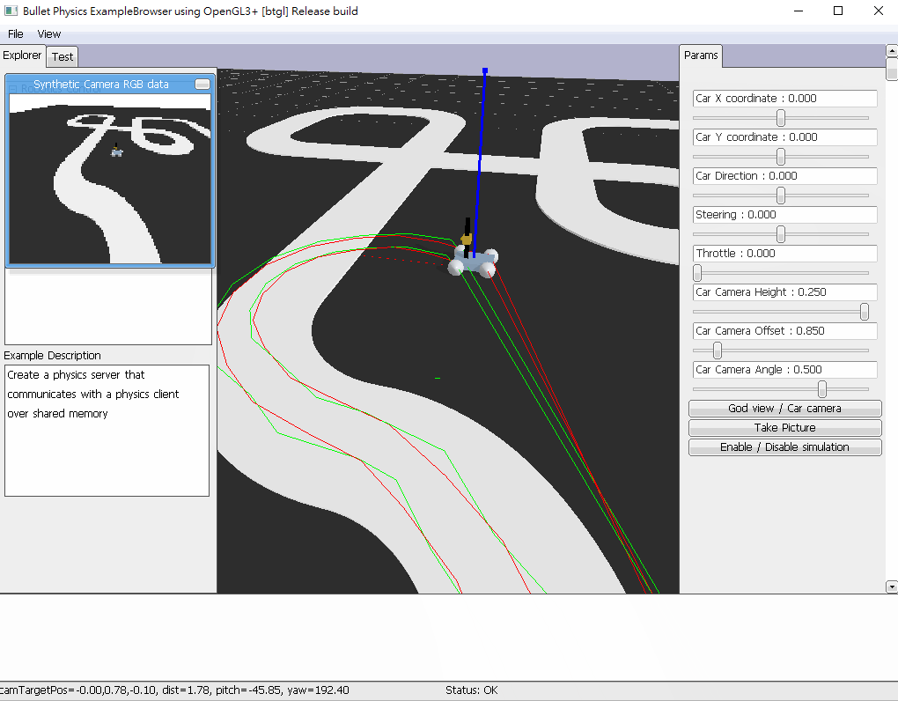

# HKUST Smart Car Simulator for **Windows**

HKUST Smart Car Simulator is a set of software package for Intelligence Racing sub-team members in Robotics Team in HKUST. Members can use the tool to test their algorithm without having the car physically.

This is the documentation for the usage of the simulator.

## Installation

### Tools needed

1. C++ (for building your client side)
2. Python 3 (for hosting the simulation server)
3. Visual Studio Code (suggested) or any other code editor
4. Git (optional, for cloning and your development)

### Set-up

Clone this project with Git into your local machine or just directly download ZIP.

```bash
git clone https://github.com/BenBenCHAK/HKUST_SmartCarSimulator.git
```

Install [PyBullet](https://pybullet.org/wordpress/) for hosting the 3D simulation server. Some other essential packages used are:
- [NumPy](https://numpy.org/install/) for providing an array storage of image
- [Sockets](https://pypi.org/project/sockets/) for client-server communication
- [PIL](https://pypi.org/project/Pillow/) for simple imaging purposes.

Install them if you have not installed before.

```bash
pip install pybullet
pip install numpy
pip install sockets
pip install pillow
```

## Usage

### Basic Directory Structure

```
/
├── lib
│   ├── sdl
│   │    └── ...
│   ├── SClib.cpp
│   ├── SClib.h
│   └── smart_car_server.py
├── src
│   ├── simplecar.urdf
│   ├── simpleplane.urdf
│   └── track.obj
├── .gitignore
├── SDL2.dll
├── makefile
├── simulation.cpp
├── simulation.exe
├── simulation_gui.cpp
├── simulation_gui.exe
└── smart_car.py
```

The "lib" directory contains both external C++ and Python libraries for the client side to get the image from the car in the server side and control the car as needed.

The "src" directory contains 3D materials and textures for the car simulation.

In the root directory:
- "smart_car.py" is the server file that you need to start for simulation;
- "simulation.cpp" is a **quickstart** demo code for the library's usage, so feel free to **modify**;
- "simulation_gui.cpp" is an optional tester code for testing if the images are correctly received, with the aid of the SDL2 library;
- "makefile" helps you compile the C++ source codes into executables, so **modify** it if you need;
- "SDL2.dll" is an essential DLL file for the SDL library;
- ".gitignore" is a file to tell git to ignore certain files / directories.

### Starting both the server and client simultaneously

For the server side, move to the root and run:
```bash
python smart_car.py
```

For the client side, move to the root and run:
```bash
make
.\simulation.exe
```

> Hint: If you cannot "make", then just manually compile the C++ code. Refer to the makefile.

### PyBullet server usage

The GUI provided looks like this:



> You can manually adjust your view in God Mode. To move around, press the arrow keys. To look around, hold any CTRL key and the left mouse button. To zoom in or out, scroll the mouse wheel or hold any CTRL key and the right mouse button.

### Right-side Params Panel usage

You can easily adjust the parameters for the simulation.



## To-do list 
- debug param panel view mode changing
- only control front wheel for turn, back for speed
- server should not close when client close
- car mass distribution, friction, size matching units
- camera projection view (i.e. fish eye stuff)
- really moving car camera
- gradual change of motor speed
- noise
- different tracks and cars to choose
- new command: reset simulation, this maybe useful for deep learning
- **code refactoring and beautifying**
- PID (PD Control as in setJointMotorControl2)

## Q&A

<!-- ## Contributing
Pull requests are welcome. For major changes, please open an issue first to discuss what you would like to change. -->

## Authors and acknowledgment
Contact me at <whchak@connect.ust.hk> or find me directly if you find any bugs or need any aids.

<!-- 
## License
[MIT](https://choosealicense.com/licenses/mit/) -->
